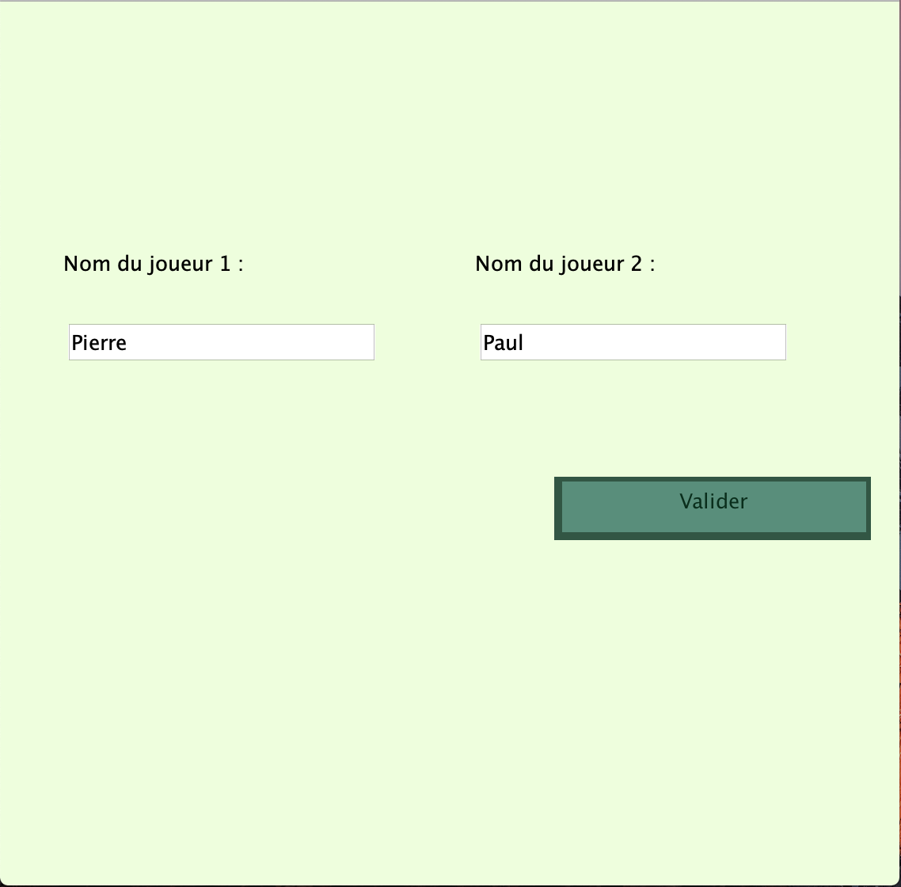
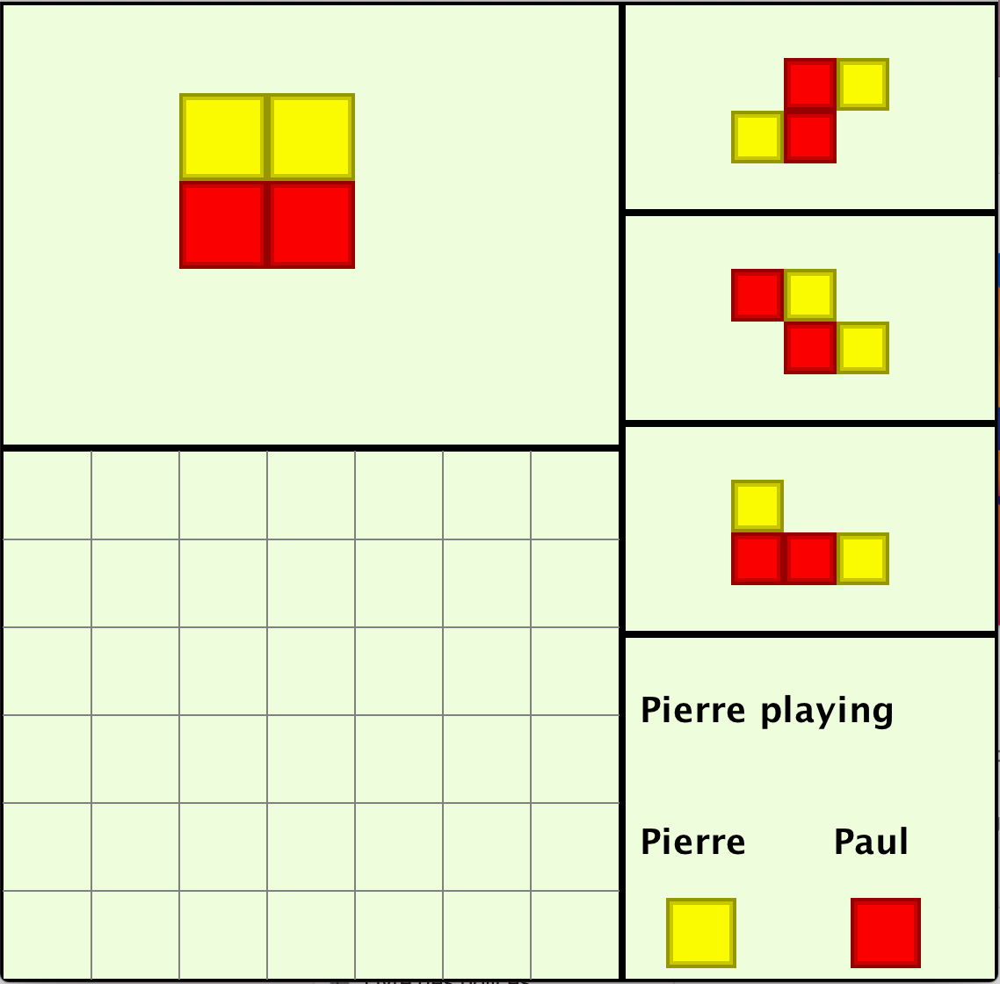
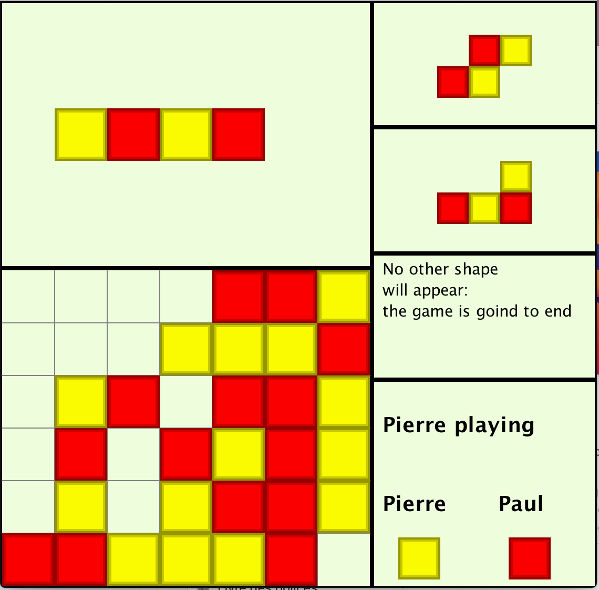
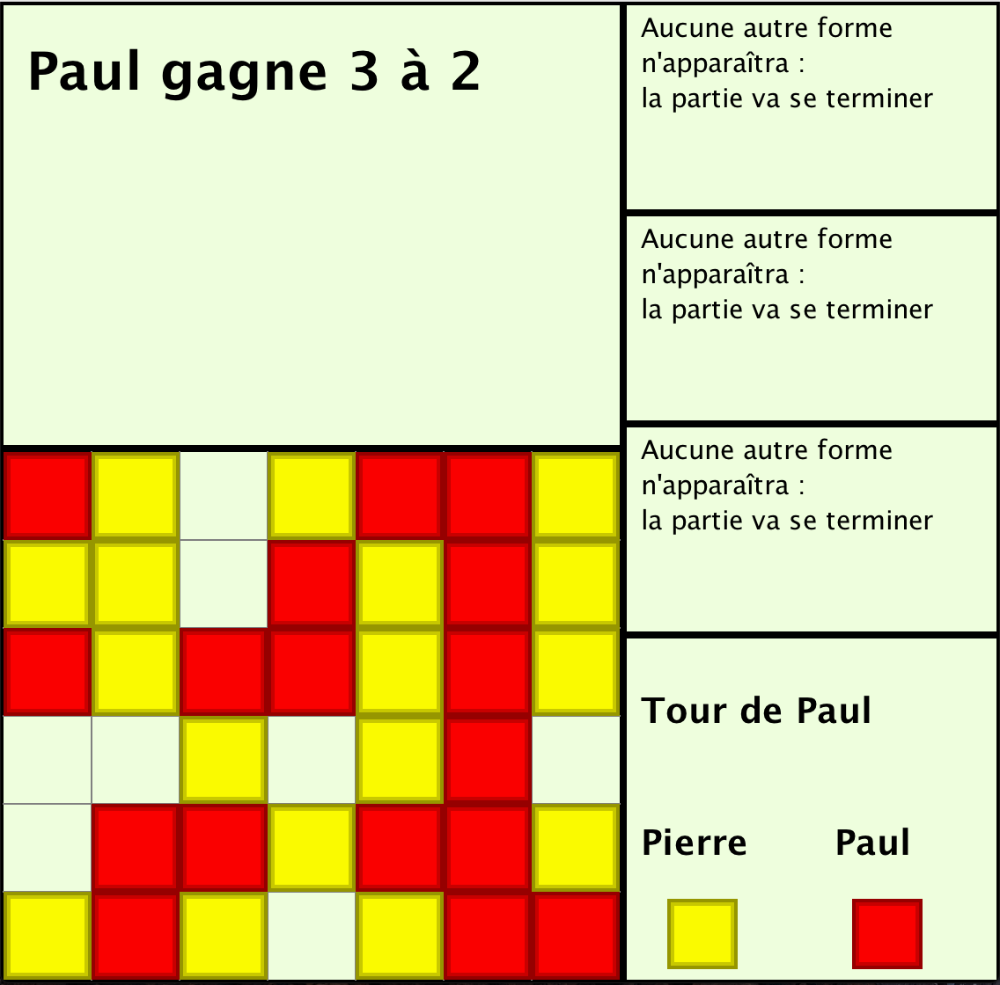
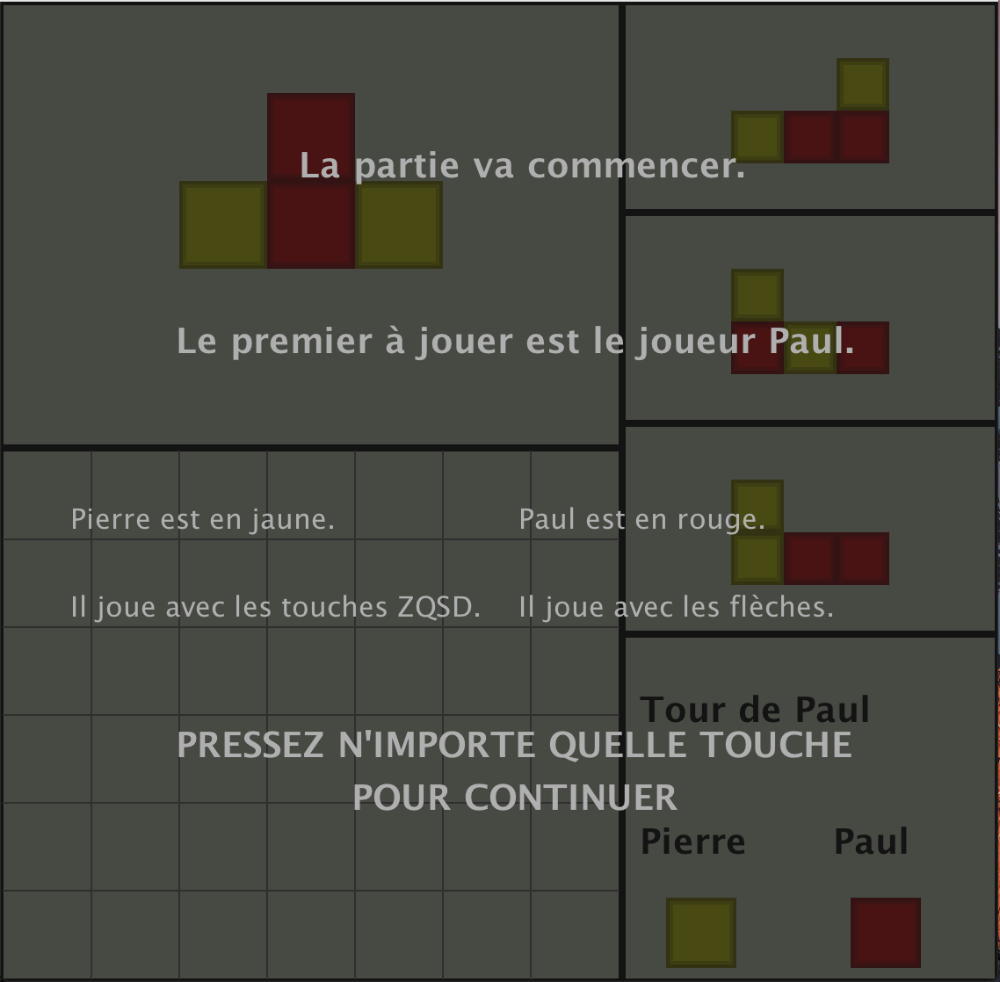
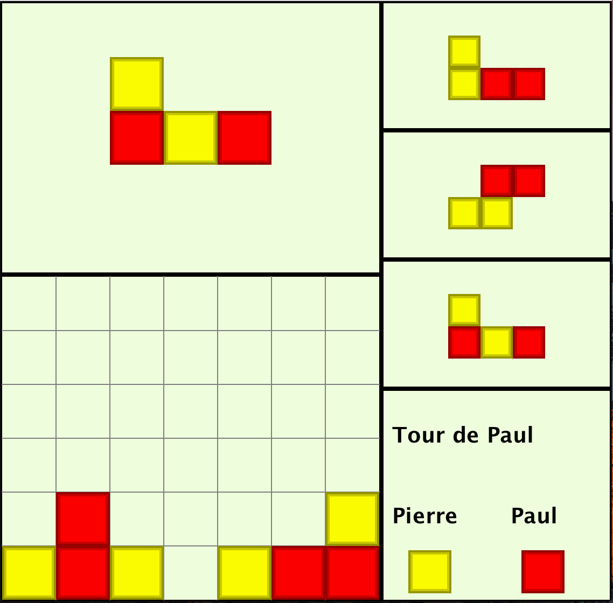

This game is a fusion of the "Connect 4" with "Tetris" shapes.
2 players duel each other. Here, players have been named Pierre (yellow squares) and Paul (red squares). Each player, when it is his turn, places a randomly generated Tetris shape in a grid (width: 7 squares, height:6 squares).

	
	

When a column is entirely filled, the next 3 shapes (which were already displayed on the screen) are played. Then, the game ends. We then count how many red (respectively yellow) squares are aligned (horizontally, vertically and diagonally). The player with the highest number of aligned squares wins the game.

	
	

Players can move shapes left and right using left and right arrows (or "A" and "D" for the other player). They can rotate the shapes using up arrow (or "W"). When the shape is in position and one wishes to place it inside the grid, one can do so by pressing the down arrow (or "S").

	
	

<h1>Good game !</h1>